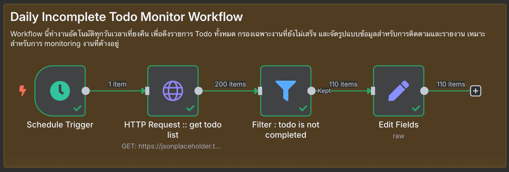

# Daily Incomplete Todo Monitor Workflow

## 📋 ภาพรวม

Workflow นี้ทำงานอัตโนมัติทุกวันเวลาเที่ยงคืน เพื่อดึงรายการ Todo ทั้งหมด กรองเฉพาะงานที่ยังไม่เสร็จ และจัดรูปแบบข้อมูลสำหรับการติดตามและรายงาน เหมาะสำหรับการ monitoring งานที่ค้างอยู่

## 🎯 วัตถุประสงค์

- ตรวจสอบ Todo ที่ยังไม่เสร็จอัตโนมัติทุกวัน
- กรองข้อมูลเฉพาะงานที่ต้องติดตาม
- จัดรูปแบบข้อมูลให้พร้อมสำหรับการประมวลผลต่อ
- สร้างรายงานงานค้างประจำวัน

## 🔧 โครงสร้าง Workflow



### Node ที่ใช้งาน:

1. **Schedule Trigger** - เรียกใช้งานอัตโนมัติทุกวันเที่ยงคืน
2. **HTTP Request** - ดึงรายการ Todo ทั้งหมด
3. **Filter** - กรองเฉพาะ Todo ที่ยังไม่เสร็จ
4. **Edit Fields** - จัดรูปแบบข้อมูลใหม่

## ⚙️ การตั้งค่าแต่ละ Node

### 1. Schedule Trigger
```
Trigger Interval: Days
Days Between Triggers: 1
Trigger at Hour: 0 (midnight)
Trigger at Minute: 0
Timezone: Asia/Bangkok (หรือตามที่ต้องการ)
```

**การทำงาน:** เริ่ม workflow ทุกวันเวลา 00:00:00

### 2. HTTP Request
```
Method: GET
URL: https://jsonplaceholder.typicode.com/todos
Headers: Default
Authentication: None
Response Format: JSON
```

**ข้อมูลที่ได้รับ:** รายการ Todo ทั้งหมด (200 รายการ)
```json
[
  {
    "userId": 1,
    "id": 1,
    "title": "delectus aut autem",
    "completed": false
  },
  {
    "userId": 1,
    "id": 2,
    "title": "quis ut nam facilis et officia qui",
    "completed": false
  },
  ...
]
```

### 3. Filter
```
Condition: {{ $json.completed }} is true
Keep Items Where: Expression is false
```

**หมายเหตุ:** Filter นี้จะเก็บเฉพาะ Todo ที่ `completed = false` (งานที่ยังไม่เสร็จ)

### 4. Edit Fields
```javascript
{
  "todoId": {{ $json.id }},
  "todoTitle": "{{ $json.title }}",
  "todoStatus": {{ $json.completed }}
}
```

**ผลลัพธ์ที่ได้:**
```json
[
  {
    "todoId": 1,
    "todoTitle": "delectus aut autem",
    "todoStatus": false
  },
  {
    "todoId": 2,
    "todoTitle": "quis ut nam facilis et officia qui",
    "todoStatus": false
  },
  ...
]
```

## 🚀 วิธีการใช้งาน

### การ Import Workflow

1. ดาวน์โหลดไฟล์ `daily_incomplete_todo_monitor.json`
2. เข้าไปที่ N8N Web Interface
3. คลิก **"+"** → **"Import from file"**
4. เลือกไฟล์ที่ดาวน์โหลด
5. คลิก **"Import"**

### การเปิดใช้งาน

1. คลิกที่ Toggle **"Active"** ในหน้า workflow
2. Workflow จะเริ่มทำงานอัตโนมัติตามกำหนดเวลา
3. ตรวจสอบ execution history เพื่อดูผลการทำงาน

### การทดสอบ Workflow

1. คลิกที่ **"Execute workflow"** เพื่อทดสอบ
2. ตรวจสอบผลลัพธ์ที่แต่ละ Node
3. ดูจำนวน Todo ที่ถูกกรองออกมา

## 🔍 การทำงานแบบละเอียด

### Step 1: Schedule Trigger
- ทำงานอัตโนมัติทุกวันเวลาเที่ยงคืน (00:00)
- ส่งสัญญาณเริ่มต้นไปยัง HTTP Request Node

### Step 2: ดึงข้อมูลจาก API
- HTTP Request เรียก GET API ไปยัง JSONPlaceholder
- ได้รับรายการ Todo ทั้งหมด (ประมาณ 200 รายการ)
- ข้อมูลแต่ละรายการจะถูกส่งต่อไปยัง Filter Node

### Step 3: กรองข้อมูล
- Filter Node ตรวจสอบ `completed` field ของแต่ละ Todo
- เก็บเฉพาะ Todo ที่ `completed = false`
- Todo ที่เสร็จแล้ว (`completed = true`) จะถูกกรองออก

### Step 4: จัดรูปแบบข้อมูล
- Edit Fields รับเฉพาะ Todo ที่ยังไม่เสร็จ
- แปลงชื่อ field ให้เป็นมาตรฐาน
- ส่งออกข้อมูลในรูปแบบที่กำหนด

## 📊 สถิติการทำงาน

จาก JSONPlaceholder API:
- **Todo ทั้งหมด:** 200 รายการ
- **Todo ที่เสร็จแล้ว:** ~90 รายการ
- **Todo ที่ยังไม่เสร็จ:** ~110 รายการ

## 🛠️ การปรับแต่ง

### เปลี่ยนเวลาทำงาน

**ทุก 12 ชั่วโมง:**
```
Trigger at Hour: 0, 12
Trigger at Minute: 0
```

**ทุกสัปดาห์ (วันจันทร์):**
```
Trigger Interval: Weeks
Weekdays: Monday
Trigger at Hour: 9
```

### เพิ่มเงื่อนไขการกรอง

**กรองตาม User ID:**
```javascript
{{ $json.completed === false && $json.userId === 1 }}
```

**กรองตาม Keyword ใน Title:**
```javascript
{{ $json.completed === false && $json.title.includes("important") }}
```

### เพิ่ม Output Fields

```javascript
{
  "todoId": {{ $json.id }},
  "todoTitle": "{{ $json.title }}",
  "todoStatus": {{ $json.completed }},
  "userId": {{ $json.userId }},
  "checkedAt": "{{ new Date().toISOString() }}",
  "priority": "{{ $json.title.includes('urgent') ? 'high' : 'normal' }}"
}
```

## 🔗 การต่อยอด

Workflow นี้สามารถต่อยอดได้หลายแบบ:

### 1. ส่งการแจ้งเตือน
เพิ่ม Node:
- **Email** - ส่งรายงานทาง Email
- **Slack** - แจ้งเตือนผ่าน Slack
- **Discord** - ส่งข้อความไป Discord

### 2. บันทึกข้อมูล
เพิ่ม Node:
- **Google Sheets** - บันทึกลง Spreadsheet
- **Database** - เก็บในฐานข้อมูล
- **File System** - บันทึกเป็นไฟล์ CSV/JSON

### 3. การวิเคราะห์
เพิ่ม Node:
- **Function** - คำนวณสstatistics
- **Chart.js** - สร้างกราฟ
- **Webhook** - ส่งไป Dashboard

## 🔧 Troubleshooting

### ปัญหาที่อาจพบ

**1. Schedule ไม่ทำงาน**
- ตรวจสอบว่า workflow เป็น "Active"
- เช็ค timezone setting
- ดู execution log

**2. Filter ไม่ทำงานถูกต้อง**
- ตรวจสอบ expression syntax
- ใช้ `{{ $json.completed === false }}` แทน `{{ $json.completed }} is true`

**3. ไม่มีข้อมูลผ่าน Filter**
- ตรวจสอบข้อมูลจาก HTTP Request
- ลอง Manual Test แต่ละ Node

**4. เวลาไม่ตรง**
- ตั้งค่า timezone ให้ถูกต้อง
- ตรวจสอบ server time

## 📊 Monitoring และ Alerting

### การตรวจสอบการทำงาน

```javascript
// เพิ่มใน Function Node เพื่อตรวจสอบ
if (items.length === 0) {
  // ไม่มี Todo ที่ยังไม่เสร็จ - อาจส่งแจ้งเตือนพิเศษ
} else if (items.length > 50) {
  // มี Todo ค้างมาก - อาจต้องเร่งด่วน
}
```

### Log Sample
```
[2025-06-12 00:00:01] Schedule Trigger: Started
[2025-06-12 00:00:02] HTTP Request: Fetched 200 todos
[2025-06-12 00:00:03] Filter: 110 incomplete todos found
[2025-06-12 00:00:04] Edit Fields: Formatted 110 records
[2025-06-12 00:00:05] Workflow completed successfully
```

## 📚 แหล่งข้อมูลเพิ่มเติม

- [JSONPlaceholder API Documentation](https://jsonplaceholder.typicode.com/)
- [N8N Schedule Trigger](https://docs.n8n.io/integrations/builtin/core-nodes/n8n-nodes-base.scheduletrigger/)
- [N8N HTTP Request Node](https://docs.n8n.io/integrations/builtin/core-nodes/n8n-nodes-base.httprequest/)
- [N8N Filter Node](https://docs.n8n.io/integrations/builtin/core-nodes/n8n-nodes-base.filter/)
- [N8N Cron Expression](https://docs.n8n.io/workflows/components/triggers/#cron-expression)