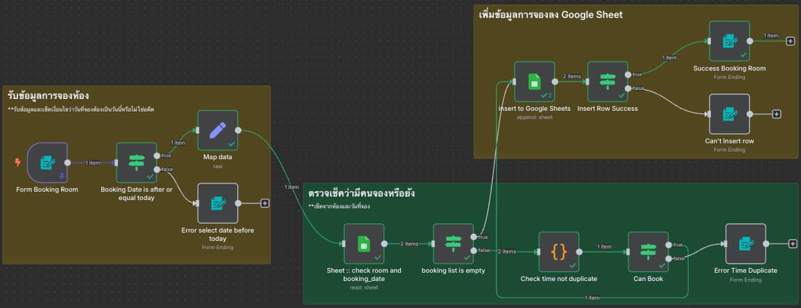

# Room Booking Validation & Auto-Insert System

## ภาพรวม (Overview)
Workflow นี้เป็นระบบจัดการการจองห้องประชุมอัตโนมัติที่มีการตรวจสอบความถูกต้องและป้องกันการจองซ้ำ โดยทำงานร่วมกับ Google Sheets เพื่อจัดเก็บข้อมูลการจอง

## การทำงาน (How it Works)

### 1. จุดเริ่มต้น (Starting Point)
- **Form Booking Room**: รับข้อมูลการจองห้องจากแบบฟอร์ม
- ข้อมูลที่รับ: ชื่อผู้จอง, วันที่จอง, เวลา, ห้องที่ต้องการจอง

### 2. การตรวจสอบวันที่ (Date Validation)
- **Booking Date is after or equal today**: ตรวจสอบว่าวันที่จองไม่ใช่วันที่ผ่านมาแล้ว
- หากวันที่ไม่ถูกต้อง → ส่งไปยัง **Error select date before today**

### 3. การดึงข้อมูลจาก Google Sheets
- **Insert to Google Sheets**: เชื่อมต่อกับ Google Sheets เพื่อดึงข้อมูลการจองที่มีอยู่
- **Map data**: จัดรูปแบบข้อมูลให้เหมาะสมสำหรับการประมวลผล

### 4. การตรวจสอบห้องและเวลา (Room & Time Validation)
- **Sheet: check room and booking date**: ตรวจสอบว่าห้องในวันเวลาที่ต้องการว่างหรือไม่
- แบ่งเป็น 2 เส้นทาง:
  - **booking list is empty**: หากไม่มีการจองในช่วงเวลานั้น
  - **Check time not duplicate**: หากมีการจองแล้ว ต้องตรวจสอบเวลาซ้ำ

### 5. การตรวจสอบเวลาซ้ำ (Duplicate Time Check)
- **Check time not duplicate**: ตรวจสอบว่าเวลาที่จองไม่ซ้ำกับการจองที่มีอยู่
- หากพบเวลาซ้ำ → ส่งไปยัง **Error Time Duplicate**
- หากไม่ซ้ำ → **Can Book**: อนุมัติการจอง

### 6. การบันทึกข้อมูล (Data Recording)
- **Success Booking Room**: บันทึกข้อมูลการจองที่สำเร็จ
- **Insert Row Success**: เพิ่มแถวใหม่ใน Google Sheets
- **Can't insert row**: จัดการกรณีที่ไม่สามารถเพิ่มข้อมูลได้

## คุณสมบัติหลัก (Key Features)

### ✅ การตรวจสอบความถูกต้อง
- ตรวจสอบวันที่จองไม่ย้อนหลัง
- ตรวจสอบการจองซ้ำในช่วงเวลาเดียวกัน
- ตรวจสอบความพร้อมของห้อง

### 🔄 การจัดการข้อผิดพลาด
- แสดงข้อความเมื่อเลือกวันที่ผ่านมาแล้ว
- แจ้งเตือนเมื่อมีการจองซ้ำ
- จัดการกรณีที่ไม่สามารถบันทึกข้อมูลได้

### 📊 การทำงานกับ Google Sheets
- อ่านข้อมูลการจองที่มีอยู่
- เพิ่มข้อมูลการจองใหม่
- จัดการข้อมูลแบบเรียลไทม์

## การติดตั้งและใช้งาน (Setup & Usage)

### ข้อกำหนดเบื้องต้น
1. บัญชี Google และ Google Sheets
2. การเชื่อมต่อ Google Sheets API ใน n8n
3. แบบฟอร์มสำหรับรับข้อมูลการจอง

### การกำหนดค่า
1. สร้าง Google Sheets สำหรับเก็บข้อมูลการจอง
2. กำหนดการเชื่อมต่อ Google Sheets ใน n8n
3. ปรับแต่งเงื่อนไขการตรวจสอบตามความต้องการ
4. ทดสอบการทำงานของ workflow

## ประโยชน์ (Benefits)
- ป้องกันการจองห้องซ้ำ
- ลดการทำงานแบบ manual
- เพิ่มความแม่นยำในการจัดการห้องประชุม
- สร้างระบบติดตามที่มีประสิทธิภาพ

## การปรับแต่ง (Customization)
Workflow นี้สามารถปรับแต่งได้:
- เพิ่มการตรวจสอบเงื่อนไขเพิ่มเติม
- ส่งการแจ้งเตือนทาง Email หรือ Slack
- เชื่อมต่อกับระบบจัดการห้องประชุมอื่น ๆ
- เพิ่มการรายงานและสถิติการใช้งาน